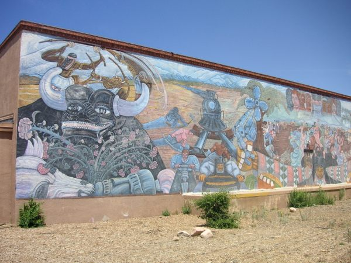

<iframe class="full aspect16-9" src="https://www.youtube.com/embed/V4Q-cZQh33c?autoplay=1&mute=1&loop=1&list=PLRNKKzTiLuHSUuXXtITI_tQJI0cNOAdWA" allowfullscreen></iframe>

The original Multi-cultural Mural was created in 1980 by artists Gilberto Guzman, Zara Kriegstein, and a team of volunteers that included Frederico Vigil, Cassandra Harris, Rosemary Stearns, and David Bradley. Multi-cultural honored the contributions made by different cultures to the history of New Mexico. Painted on the east wall of the State Records Center and Archives, the mural measured 110 x 18 feet and was repainted in 1993 by Guzman to repair damage from the elements.

Now, a QR code on a plaque at the same location will allow viewers to visualize the 1993 version of Multi-cultural on the side of the Vladem Contemporary through an augmented reality application on a smart device.

 

[View Project on 8th Wall](https://www.8thwall.com/vastlab/guzman-multicultural){: target="_blank"}

 

Original Mural

<a href="mural-original.jpg" target="_blank">{: class="half gap01" }</a>