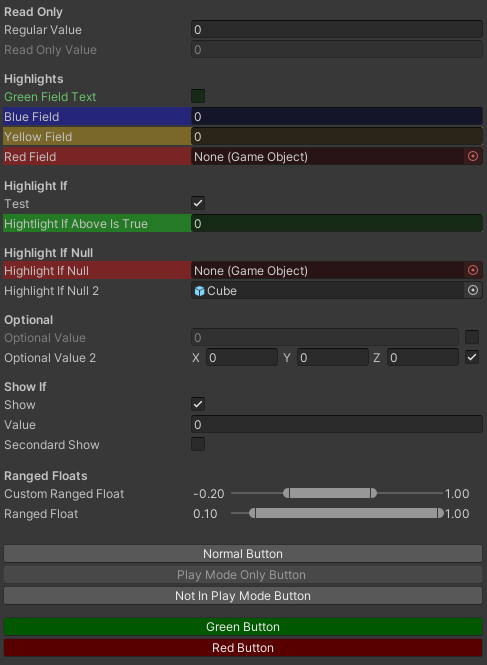
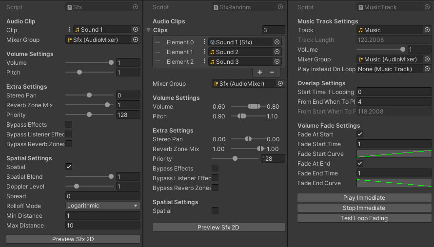
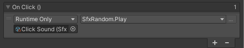

Coffey Utils is a package for Unity development that focuses on adding inspector attributes and generic resuable systems. Below are some examples of the package.

[The package is available publicly on GitHub](https://github.com/BrandonMCoffey/CoffeyUtils/).

 

### Attributes

There are many attributes that come with the package, which are both intuitive and versitile.

The most important one is a button attribute, which can be placed before any function to expose a button in the inspector that will run the function. This is useful for testing features and, in my opinion, should be a default feature within the Unity engine.

The other attributes focus on controlling the inspector view, primarily to make the process simple for a designer. Fields can be set as read only, optional, or only shown if a specified boolean variable is set.

There are also some aesthetic features such as highlighting a cell, or dynamically highlighting cells if, for instance, a required field has not been set, so it highlights red until a value is set.

 

The above image demonstrates these features, set up using the code below:


[Header("Read Only")]
[SerializeField] private float _regularValue;
[SerializeField, ReadOnly] private float _readOnlyValue;

[Header("Highlights")]
[SerializeField, Highlight(0.1f, 1f, 0.1f, HighlightMode.Text)] private bool _greenFieldText;
[SerializeField, Highlight(ColorField.Blue)] private int _blueField;
[SerializeField, Highlight(250, 200, 15)] private float _yellowField;
[SerializeField, Highlight(System.Drawing.KnownColor.Red)] private GameObject _redField;

[Header("Highlight If")]
[SerializeField] private bool _test;
[SerializeField, HighlightIf("_test")] private float _hightlightIfAboveIsTrue;

[Header("Highlight If Null")]
[SerializeField, HighlightIfNull] private GameObject _highlightIfNull;
[SerializeField, HighlightIfNull(ColorField.Green)] private GameObject _highlightIfNull2;

[Header("Optional")]
[SerializeField] private Optional<float> _optionalValue;
[SerializeField] private Optional<Vector3> _optionalValue2;

[Header("Show If")]
[SerializeField] private bool _show;
[SerializeField, ShowIf("_show")] private float _value;

[SerializeField, ShowIf("_show")] private bool _secondardShow;
[SerializeField, ShowIf("_show", "_secondardShow")] private float _secondaryValue;

// Ranged Floats have the following properties: MinValue, MaxValue, GetRandomInRange
// Set a custom valid range using the MinMaxRange attribute
[Header("Ranged Floats")]
[SerializeField, MinMaxRange(-1, 2)] private RangedFloat _customRangedFloat = new RangedFloat(0.5f);
[SerializeField] private RangedFloat _rangedFloat = new RangedFloat(0.5f, 1f);

[Button(Spacing = 20)]
private void NormalButton()
{
    Debug.Log("Runs some code when a button in the inspector is clicked");
}

[Button(Mode = RuntimeMode.OnlyPlaying)]
private void PlayModeOnlyButton() { }

[Button(Mode = RuntimeMode.OnlyEditor)]
private void NotInPlayModeButton() { }

[Button(Spacing = 10, Color = ColorField.Green)]
private void GreenButton() { }

[Button(Color = ColorField.Red)]
private void RedButton() { }


 

### Sound System

A versitile sound system for sound effects and music is optionally included with the Coffey Utils package. This allows a designer to create scriptable objects to contain audio clips as the following:
- A basic sound effect (SFX) with settings similar to an audio source's settings.
- A randomized sound effect that randomly chooses an audio clip and has randomizable settings.
- A music track that has settings for fading in and out and either looping or playing another music track instead of looping.

{: class="full"}

 

With these various scriptable objects, they can be played from a script with the Play() function or from a unity event in the inspector such as from a UI button.

