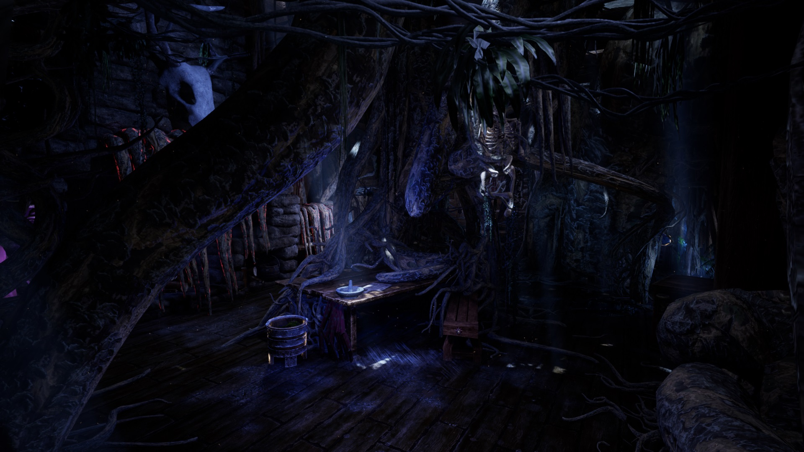
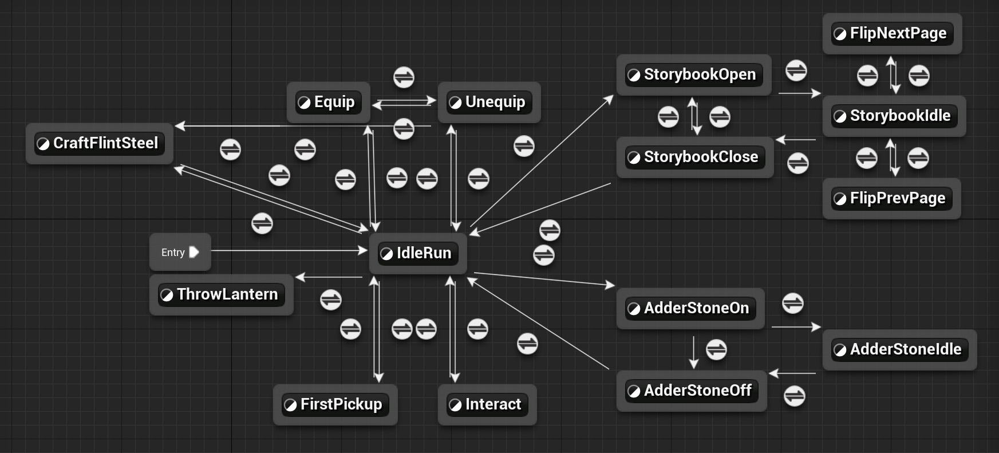
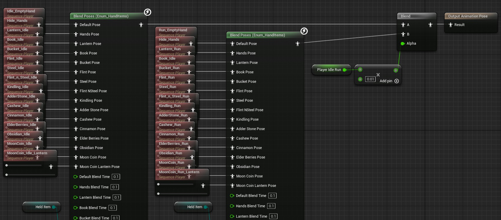

<a href="level-02.jpg" target="_blank">{: class="full gap01" }</a>

Deaths Bloom is a first person horror puzzler made by a team of 40+ students at the University of Texas at Dallas. For the game, I worked as a Programmer on various level mechanics and the core player animation blueprint.

[View Source Code on GitHub](https://github.com/metalac190/GameLab_ToborQuest){: target="_blank"}

<a href="hands-state-machine.jpg" target="_blank">{: class="full gap03" }</a>

Late into development, the art team decided to add hands to the protagonist, and I was assigned to implement the animations and all that came with it. I setup a state machine to handle every type of animation and event dispatchers to trigger the animations. Most systems and mechanics were already established at this point, so I dove deep into other people’s blueprints and implemented event calls to trigger the animations. Then, to hook up the original animations, I realized I needed a solution to handle a lot of the same animation, but holding different items.

<a href="hands-enum-blend.jpg" target="_blank">{: class="full gap03" }</a>

There were 85 individual animations in the game, most of which consisted of repeated equip, idle, and interact animations for each holdable object. Taking this on as my task, I wanted a way to build a state machine in a smart way, where I didn’t need an insane amount of states. At first I looked into arrays or different ways to select animations based on a value, but nothing came up. Later, I realized there existed an enum blend animation node, which allowed me to set up an enum for each item, and then select the animation based on which item the player was holding in the form of an enum. This allowed for a very controlled state machine that isn’t too complex.

<a href="level-03.jpg" target="_blank">{: class="full gap03" }</a>

The third and final level of the game was the main level that I worked on. I talked with the level designer, artists, and animators on the level consistently, working to bring the level to life. My focus was on the moondial in the center, the vine doors blocking the player's passage, and the monster's art and effect on the world.

<a href="moondial.jpg" target="_blank">{: class="full gap03" }</a>

The Moondial is the main mechanic of level 3 which I designed alongside the level designer. Essentially, the player can pick up coins that represent the different phases of the moon and can place them on the dial. Then, when the dial is rotated towards a new moon, the ‘light’ from the moon is siphoned into the lantern, making the lantern brighter and the moon darker. This opens up new passages both by lighting them up and making vines move out of the way (Vines avoid light in the game).


<a href="arveado.jpg" target="_blank">{: class="full gap03" }</a>
Although I did not design the AI of the monster, I implemented other functionality and set up the art and VFX of the monster.
 