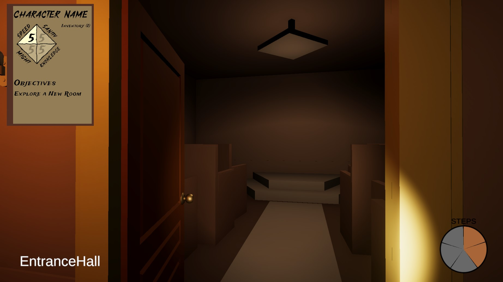
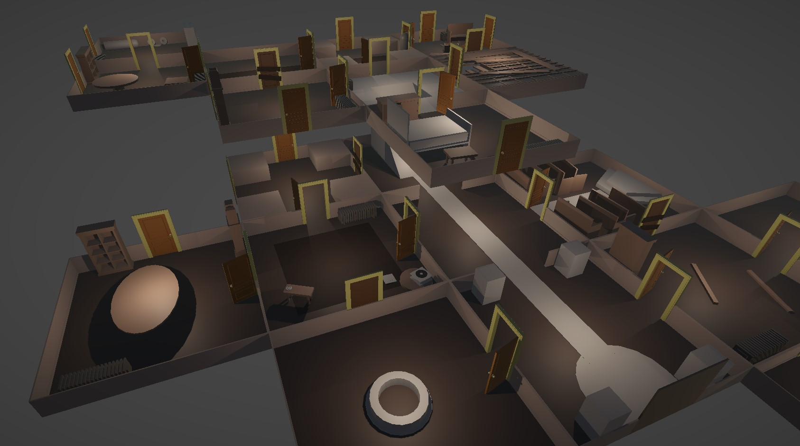

# House on the Hill Breakdown

[Back to House on the Hill Game Page](/projects/house-on-the-hill/)

 

{: class="full" }

### Room Generation Code

Room Generation for this project is complex. Each room has predefined doors that can face any cardinal direction, and when placed that room can be rotated at intervals of 90 degrees.
This means I need a way to calculate which direction the doors of any given room are facing to determine which rotation to place a room at when it is generated. Below is the resulting code that randomly selects a rotation that connects to as many rooms as possible.


var validRotations = new List<Orient>();
int totalConnections = 0;
for (int i = 0; i < 4; i++)
{
    int connections = 0;
    var localOrientations = prefab.GetDoorLocalOrientations();
    // Test for connections at each possible door
    foreach (var localOrientation in localOrientations)
    {
        var orientation = Room.AddOrientation(localOrientation, (Orient)i);
        (int xOffset, int zOffset) = Room.GetOffset(orientation);
        var otherRoom = GetRoom(x + xOffset, z + zOffset);
        if (otherRoom == null)
        {
            continue;
        }
        
        if (otherRoom.HasDoorWithOrientation(Room.ReverseOrientation(orientation)))
        {
            connections += orientation == connection ? 11 : 1;
        }
        else
        {
            connections--;
        }
    }
    if (connections == totalConnections)
    {
        validRotations.Add((Orient)i);
    }
    else if (connections > totalConnections)
    {
        totalConnections = connections;
        validRotations = new List<Orient>() { (Orient)i };
    }
}
rot = (int)validRotations[Random.Range(0, validRotations.Count)];


The core of this function revolves around the amount of ‘connections’ each orientation has. This value is used to find the best rotations, and store them in a list so one can be chosen randomly.
The door ‘connections’ value is increased or decreased depending on if a door is actually connected to an adjacent room. If the door is the one the player opened from, it is increased by an additional 10 to ensure that the player’s door is always chosen.


if (otherRoom.HasDoorWithOrientation(Room.ReverseOrientation(orientation)))
{
    connections += orientation == connection ? 11 : 1;
}
else
{
    connections--;
}


Room Generation and Door Connections:

{: class="full" }

 

### Door Generation Code

After a new room is generated, it must check all sides to create doors or lock doors.
Each comment in this function is a possible outcome for what the door should be:
-	No adjacent room → Create closed door that can be opened / explored
-	Adjacent room with a connection → Ensure the door is open and update door labels
-	Adjacent room with no connection → Create locked door that can never be opened
-	No door but has an adjacent room with a door → Lock the other room’s door


void GenerateDoor(Orient worldOrient, bool create)
{
    (int x, int z) = GetOffset(worldOrient);
    var connectedRoom = _generator.GetRoom(X + x, Z + z);
    if (!connectedRoom && create)
    {
        // Create a door that can be explored (No connection until the player opens it)
        var door = _generator.CreateDoor();
        door.SetRoom(this, worldOrient);
        SetDoorTransform(door.transform, worldOrient);
        _doors.Add(door);
    }
    else if (connectedRoom)
    {
        // Connected room already exists
        var door = connectedRoom.GetDoor(ReverseOrientation(worldOrient));
        switch (door != null, create)
        {
            case (true, true):
                // Existing door with a connection
                door.Open(false);
                door.SetLabels(connectedRoom.Name, Name);
                break;
            case (false, true):
                // Create a locked door -- no connection
                SetDoorTransform(_generator.CreateLockedDoor().transform, worldOrient, true);
                break;
            case (true, false):
                // Existing door -- but no connection -- lock other door
                connectedRoom.DestroyDoor(door);
                SetDoorTransform(_generator.CreateLockedDoor().transform, worldOrient);
                break;
        }
    }
}


 

### Scriptable Objects

{: class="full" }

Character Data and Item Data was written in the form of scriptable objects for easy manipulation and better understanding of what the values actually did.
