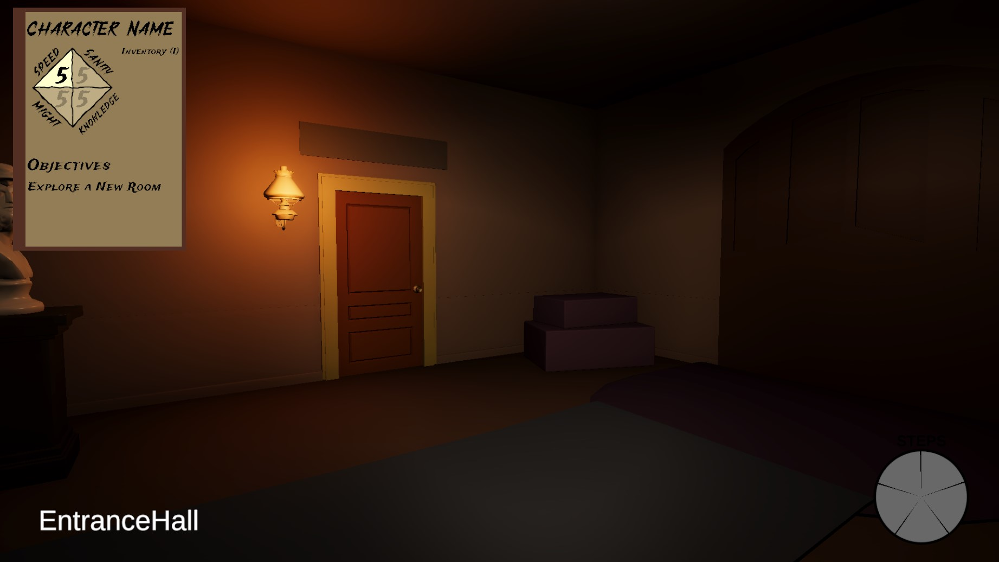
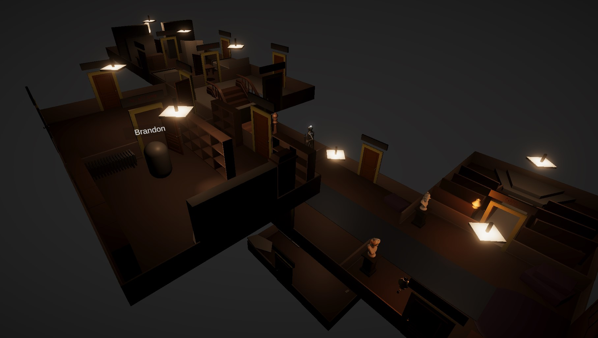
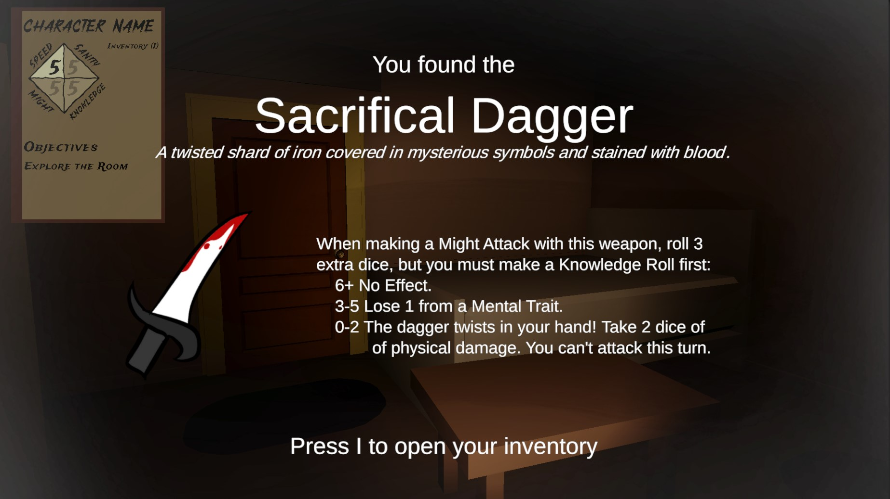

House on the Hill is a digital first person adaptation of the board game: Betrayal at House on the Hill by Avalon Hill. The game can be downloaded from Itch.io in the link below, along with a dedicated server to host the multiplayer aspects of the game (It is also playable single-player but intended for multiplayer).

<iframe frameborder="0" src="https://itch.io/embed/2061249?dark=true" width="552" height="167">
    <a href="https://brandoncoffey.itch.io/house-on-the-hill">House on the Hill by BrandonCoffey</a>
</iframe>

 

[View Game Breakdown]({{page.url}}/breakdown/)

 

Singleplayer Demo

<iframe class="full aspect16-9" src="https://www.youtube.com/embed/NyFtgEqdz90?autoplay=1&mute=1&loop=1&list=PLRNKKzTiLuHQtC4vdcU6M_UHRZpkqV2ei&index=1" allowfullscreen></iframe>

 

Multiplayer Demo

<iframe class="full aspect16-9" src="https://www.youtube.com/embed/K8LB0NQ87BY?autoplay=1&mute=1&loop=1&list=PLRNKKzTiLuHRovaKzLLbRiDtEsU9AY5KB&index=1" allowfullscreen></iframe>

 

# Screenshots

{: class="full" }

 

Spectator View

{: class="full" }

 

Item and Omen Pickups

{: class="full" }

 

[View Game Breakdown]({{page.url}}/breakdown/)