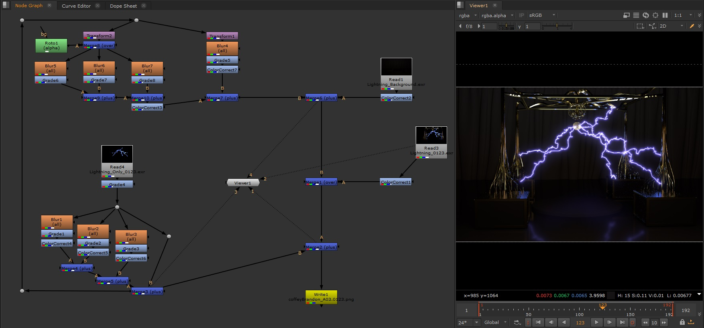

 

###  Bedroom Lighting
#### Autodesk Maya - Arnold Lighting
<a href="bedroom-lighting.jpg" target="_blank">{: class="full" }</a>

For a lighting and composition project, I was provided an existing 3D model of a room, and asked to light the room in any way. I added textures and basic materials to give the render a clean look, and did a lot of soft lighting and nuke compositing to make a smooth and cozy bedroom render.

 

### Camera Shoot
#### Houdini
<a href="camera-shoot.jpg" target="_blank">{: class="full" }</a>

In Houdini, I set up and composited various CG assets in a realistic manor. Using the Mantra renderer, I set up lights and material nodes and got to work making the composition look exactly how I wanted it to. My main focuses were on the depth of field on the plant and the lens on the camera.

 

### Spiderman: No Way Home VFX Recreation
#### Houdini and Nuke Comp
<iframe class="full aspect16-9" src="https://www.youtube.com/embed/I4qBPPt2_6M?autoplay=1&mute=1&loop=1&list=PLRNKKzTiLuHTs8TA5Axug4cdoWctY6-OQ" allowfullscreen></iframe>

For a Visual FX project I re-created a shot from Spider-Man: No Way Home, attempting to replicate the VFX and lighting of the shot in Houdini. I started with the lightning and created a similar flow of lightning and then set up a shot using free models online. After some work I got the lighting and composition to look close, so I spent the rest of the time on the VFX and comped it together in Nuke, using cryptomattes and specular AOVs to increase the reflections and make the render look closer to the original shot.

 

### Prestige Shot Recreation
#### Houdini and Nuke Comp
<a href="nuke-prestige-comp.jpg" target="_blank">{: class="full" }</a>

On an earlier VFX project, I replicated a shot from the movie Prestige, setting up a basic scene and the lightning. In the Houdini render, there were very little to no reflections on the ground, so in Nuke I added a custom pass of reflections by adding the lighting in multiple times, transforming it, and blurring it slightly to give the look of lightning reflecting off of the floor.
