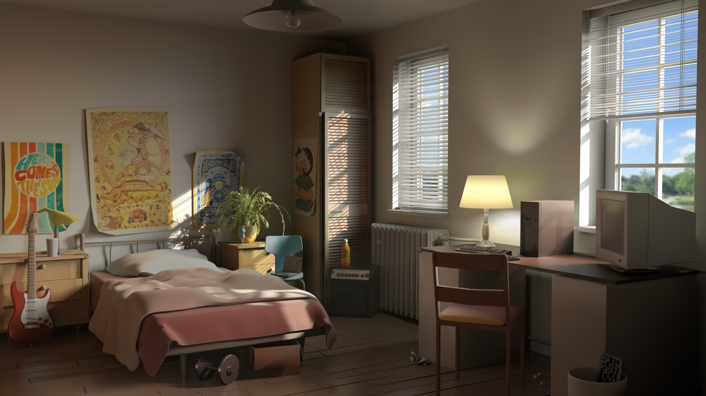
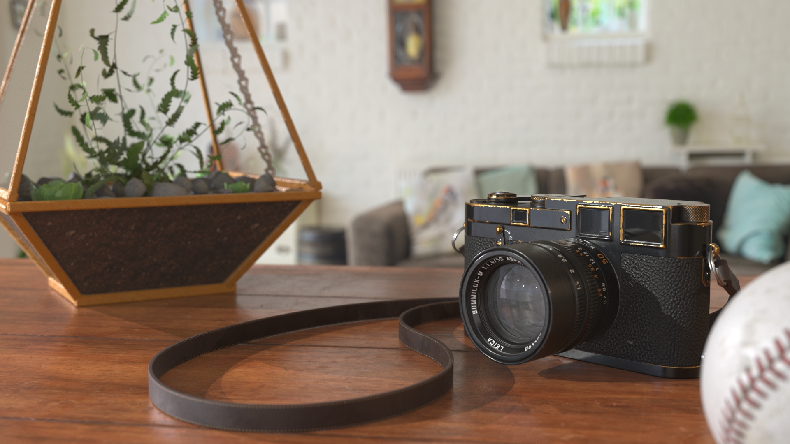

 

###  Bedroom Lighting
#### Autodesk Maya - Arnold Lighting

{: class="full" }

For a lighting and composition project, I was provided a preexisting 3D model of a room and asked to simply light the room. I decided to make my own kind of room, and decorate it as a cozy, soft, and comfortable living space. Finding textures online and creating basic materials to give the render a clean look, the room came together with intentionally soft lighting and some compositing in Nuke.

 

### Camera Shoot
#### Houdini Rendering

{: class="full" }

In Houdini, I set up and composited various CG assets in a realistic manor. Using the Mantra renderer, I set up lights and material nodes and got to work making the composition look exactly how I wanted it to. My main focuses were on the depth of field on the plant and the lens on the camera.
