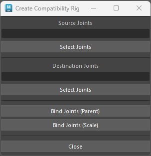

 

### Maya to Unity/Unreal Rig Exporter

When exporting rigs and animations done in Autodesk Maya to Unreal Engine or Unity, any custom deform nodes or constraints are unable to normally be exported. This became apparent with my experience in [Death Bloom]({{site.url}}/projects/death-bloom/) and [Kitty City]({{site.url}}/projects/kitty-city/), when animators used custom rigs that they were used to, as they were not used to building rigs for game development. So, I created a tool, called CreateCompatibilityRig, which does the following:
- Allows the user to specificy components of the source rig
- Duplicates the entire joint structure and skinned mesh
- Creates position and rotation constraints from the source joints to the new joints

{: class="full" }

<i>Left: Source Maya Rig. Middle: Duplicated Joint Structure. Right: Output Mesh Compatible with Unity</i>

 

Below is the code for the tool, which can be loaded into Maya and run with the 'run()' function. This opens a QT window, which is Maya's GUI interface, and all of the user interaction is through buttons and text fields.


def run():
    rigCreator = CreateCompatibilityRig()
    rigCreator.init_gui()

class CreateCompatibilityRig:
    def __init__(self):
        self.windowName = 'unrealRigCreator'
        self.sourceJointsField = None
        self.sourceJoints = None
        self.destinationJointsField = None
        self.destinationJoints = None

    def init_gui(self):
        # Delete Existing Window if it Exists
        if cmds.window(self.windowName, exists=True):
            cmds.deleteUI(self.windowName)

        # Create Window
        cmds.window(self.windowName, title='Rig Transplant', widthHeight=(250, 300))

        # Content
        cmds.columnLayout(adjustableColumn=True, rowSpacing=5)
        cmds.separator(height=1)
        cmds.text(l='Source Joints')
        self.sourceJointsField = cmds.textField()
        cmds.button(l='Select Joints', command=self.select_source_joints)
        cmds.separator(height=10)
        cmds.text(l='Destination Joints')
        self.destinationJointsField = cmds.textField()
        cmds.button(l='Select Joints', command=self.select_destination_joints)
        cmds.separator(height=10)
        cmds.button(l='Bind Joints (Parent)', command=self.set_parent_constraints)
        cmds.button(l='Bind Joints (Scale)', command=self.set_scale_constraints)
        cmds.separator(height=10)
        cmds.button(label='Close',
                    command=('cmds.deleteUI(\"' + self.windowName + '\", window=True)'))

        # Display Window
        cmds.showWindow(self.windowName)

    def select_source_joints(self, *args):
        selected = cmds.ls(selection=True)
        self.sourceJoints = cmds.listRelatives(selected, ad=True, type='joint')
        cmds.textField(self.sourceJointsField, edit=True,
                       tx=str(self.sourceJoints))

    def select_destination_joints(self, *args):
        selected = cmds.ls(selection=True)
        self.destinationJoints = cmds.listRelatives(selected, ad=True, type='joint')
        cmds.textField(self.destinationJointsField, edit=True,
                       tx=str(self.destinationJoints))

    def set_parent_constraints(self, *args):
        sj = self.sourceJoints
        dj = self.destinationJoints
        for x in range(0, len(sj)):
            if not cmds.objExists(sj[x]):
                continue
            if cmds.objectType(sj[x], isType='joint') == 1:
                cmds.select(d=True)
                cmds.parentConstraint(sj[x], dj[x])

    def set_scale_constraints(self, *args):
        sj = self.sourceJoints
        dj = self.destinationJoints
        for x in range(0, len(sj)):
            if not cmds.objExists(sj[x]):
                continue
            if cmds.objectType(sj[x], isType='joint') == 1:
                cmds.select(d=True)
                cmds.scaleConstraint(sj[x], dj[x])



[Image of Stacker Tool]
With python and Qt, I built a simple interface to select objects and stack them on each other based on their bounding box sizes.
 