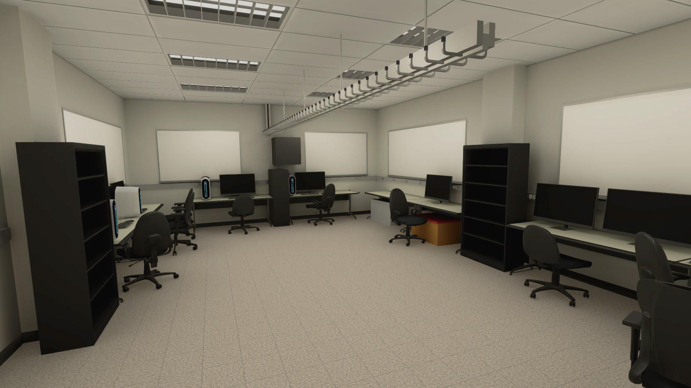
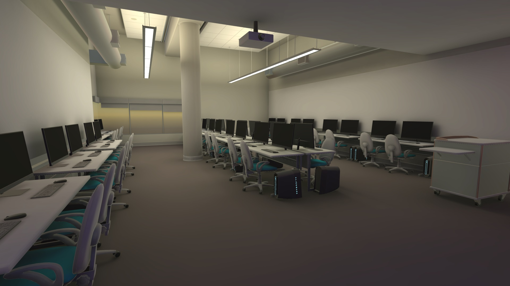

<iframe class="full aspect16-9" src="https://www.youtube.com/embed/opzd9oXuIao?autoplay=1&mute=1&loop=1&list=PLRNKKzTiLuHS1DhjKuSDYt4chYslvZ-Yb" allowfullscreen></iframe>

For a Metaverse-style project I modeled the CS lab I worked at and integrated Meta Avatars so we could experience the lab as a digital twin. I designed various calibration methods to sync the VR headsets with the real room so we could demo virtual avatars mixed with real people at the same location with the modality of a digital twin and IoT devices that sync between the real and virtual world. This was done with Meta Quest headsets and both the Oculus Integration package and MRTK 2 for interactions.

[View MetaTwin: Synchronizing Physical and Virtual Spaces for Seamless World](https://dl.acm.org/doi/10.1145/3562939.3565647){: target="_blank"}

 

Model of the [MI Lab]({{site.url}}/mi-lab/){: target="_blank"} main room:

{: class="full" }

 

Additionally, for a similar project, I modeled a computer lab at the ATEC building at UTD and implemented a different networking solution and interactions using Unity's openxr package.

[View Side by Side with Actual Lab](https://www.linkedin.com/posts/activity-6980256837178720256-yti5){: target="_blank"}

{: class="full" }
