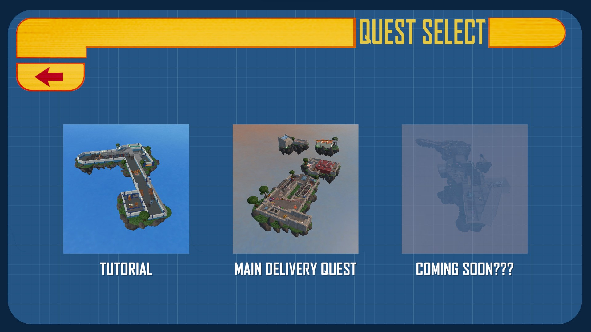
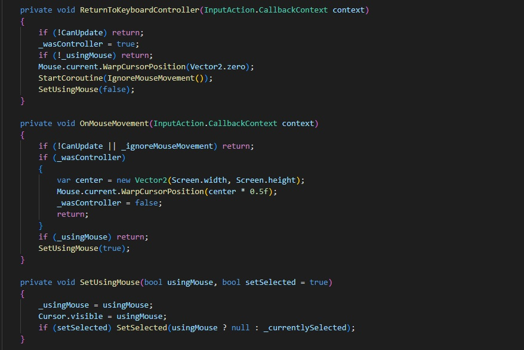
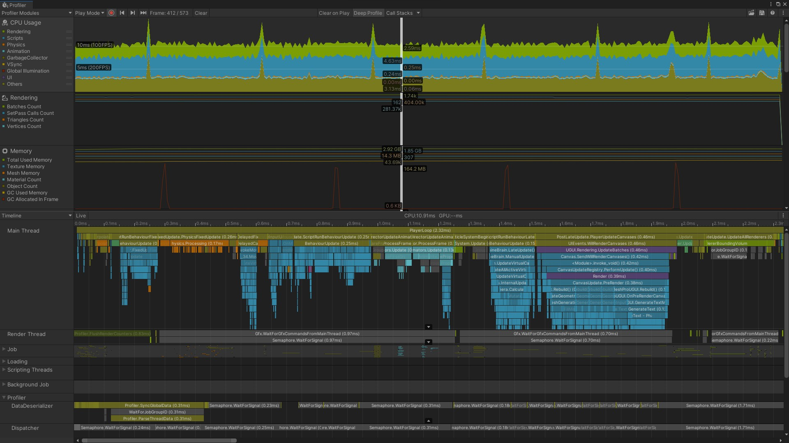
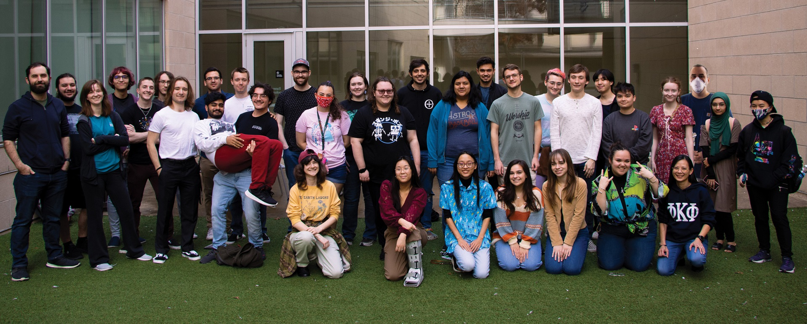

<iframe class="full aspect16-9" src="https://www.youtube.com/embed/sdNzyZh9RNU?autoplay=1&mute=1&loop=1&list=PLRNKKzTiLuHQo_nG3suXDMp9r3IJNDwYE" allowfullscreen></iframe>

As Programming Lead of this fun and whacky car game, my goal was to keep development fun and enjoyable. I encouraged creative ideas and kept the team excited about the game by letting fun and whacky ideas come to life and bring that in as part of the final game. I communicated consistently with the design, art, and sound leads to make sure there were minimal hiccups and frustrations, and kept the development process enjoyable for a lot of people, consistely showing off what the programmers were up to and having laughs with other people on the team.

[View Released Game](https://atec-animgames.com/game-lab){: target="_blank"}

[View Source Code on GitHub](https://github.com/metalac190/GameLab_ToborQuest){: target="_blank"}

 

### Quest Menu
<a href="quest-menu.jpg" target="_blank">{: class="full" }</a>

Around the Beta release of the game, it felt like a core component of the game loop was missing. For Tobor Quest, there was no quest, only some scattered levels without much continuity or transition between them. So I talked to the lead designer, and we came up with a solution of a Quest Menu, which allowed players to play through the ‘quest’ as a whole, or simply play a level out of context in the quest. More important, though, it allowed the tutorial to be separated into its own quest instead of being part of the main quest, which felt weird and jarring to the experience. This also gave opportunity to open the game up to other quests, if the game had future development.

 

### Controller and Mouse Automatic Switching
<a href="controller-mouse-switching.jpg" target="_blank">{: class="full" }</a>

I set up an automatic system to properly switch between keyboard and controller seamlessly, switching button prompts and removing the mouse from the screen when using controller. I found this to be very important, because during playtesting, I would notice that players would leave their mouse on the screen, and it would hover buttons while they were using controller, and that felt annoying, so I made a solution. Basically it detects any controller navigation and moves the mouse to the far corner of the screen, and disables it. Then if any mouse movement is detected, it moves the mouse to the center of the screen and it shows back up, disabling the selected UI object the controller had. It’s annoying that Unity’s UI Input Module does not support this properly, but now I have a built solution that can be imported into any project and setup instantly.

 

### Profiling and Optimization
<a href="unity-profiler.jpg" target="_blank">{: class="full" }</a>

As development neared completion and the game was in content lock, I began profiling the game and finding points of weakness in the code, physics, or art of the game. Then I would delegate out the tasks to the relevant artists or programmers, and it would be fixed relatively quickly. One major optimization was actually with the UI, as Unity was Raycast checking the UI every frame and objects were being animated and disabled/enabled on the UI. This was horrible for performance, so I split up the sections into their own canvases, which allowed groups like the HUD to not have any graphics raycaster, improving performance. Additionally, we switched the animator components to tween scripts, and with some other optimizations it was performing much smoother.

 

### The Team
<a href="tobor-quest-team.jpg" target="_blank">{: class="full" }</a>

The Team was all amazing to work with and very talented. It was a pleasure to bring such a fun game to reality.
