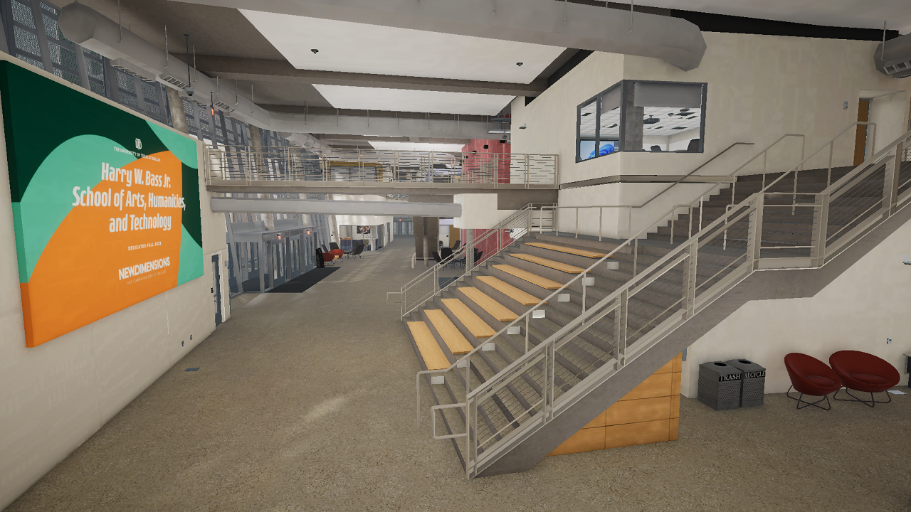
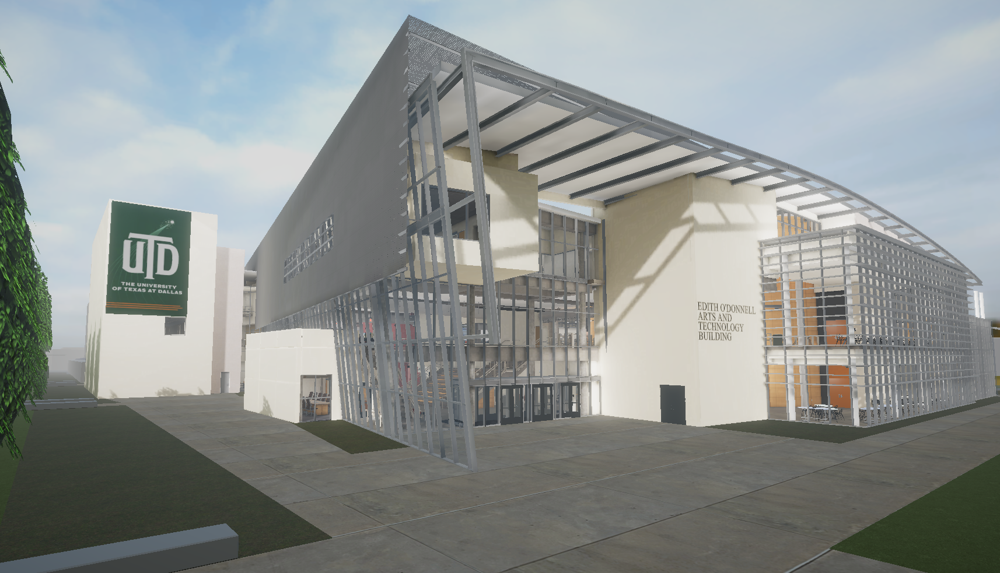
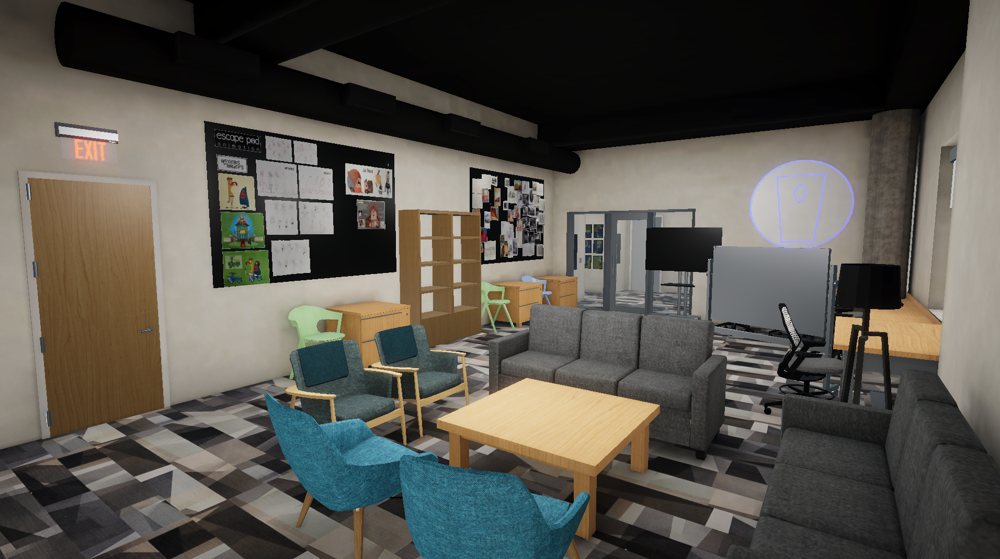

<iframe class="full aspect16-9" src="https://www.youtube.com/embed/SwHDWms1ypQ?autoplay=1&mute=1&loop=1&list=PLRNKKzTiLuHSQDn9zd2bokD-c4tA-TSPp" allowfullscreen></iframe>

 

The UTD Campus Digital Twin is a virtual reconstruction of the buildings at the University of Texas at Dallas, hosted as a Metaverse on the [Spatial.io](https://www.spatial.io/s/UTD-School-of-Arts-Humanities-and-Technology-65e7bba43cbbbf6b6bb4b0e9?share=5810302130767391610){: target="_blank"} website.

 

{: style="width:49.6%"}
{: style="width:49.6%"}

{: style="width:49.6%"}
{: style="width:49.6%"}
