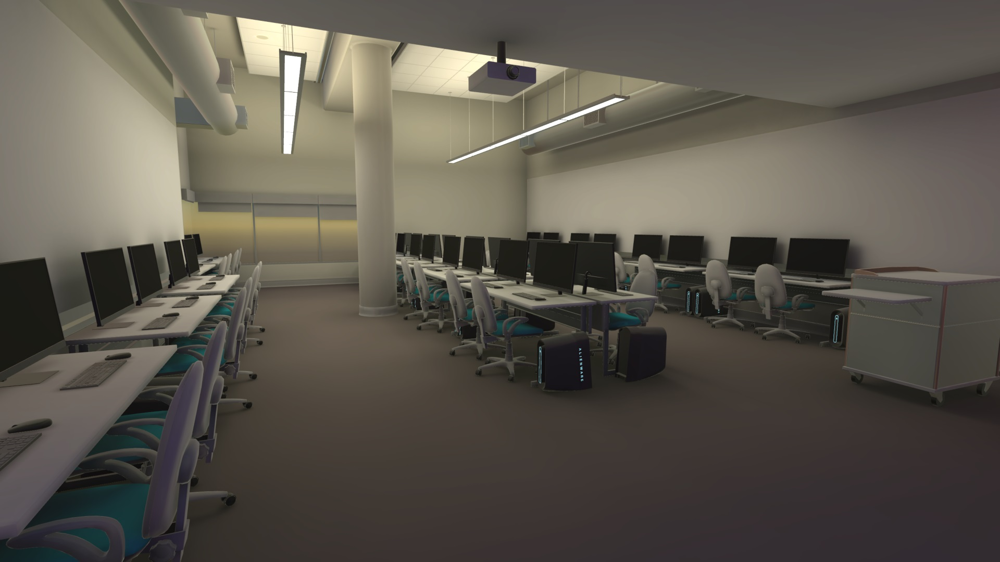

 

###  Wind Visualization
#### Oculus, Unity, and Ultrahaptics
<iframe class="full aspect16-9" src="https://www.youtube.com/embed/PFHeb2d0LdI?autoplay=1&mute=1&loop=1&list=PLRNKKzTiLuHSRl2BjtAkN8wA_fSlHWb3t" allowfullscreen></iframe>

For a research project I worked with a CS Graduate student to bring air tunnel wind data to a real-time visualization in VR with mid-air haptic feedback.

[View Data Abstraction for Visual and Haptic Representations in Flow Visualization](https://dl.acm.org/doi/10.1145/3562939.3565651){: target="_blank"}

 

###  MetaTwin
#### Oculus and Unity
<a href="mi-lab.jpg" target="_blank">{: class="full" }</a>

For a Metaverse-style project I modeled the CS lab I worked at and integrated Meta Avatars so we could experience the lab as a digital twin. Then, I designed various calibration methods to sync the Oculus Quest 2s with the real room so we could demo virtual avatars mixed with real people at the same location with the modality of a digital twin and IoT devices that sync between the real and virtual world.
Link to Abstract

[View MetaTwin: Synchronizing Physical and Virtual Spaces for Seamless World](https://dl.acm.org/doi/10.1145/3562939.3565647){: target="_blank"}

 

###  ATC Lab
#### Oculus and Unity
<a href="atec-lab.jpg" target="_blank">{: class="full" }</a>

During a simple class project for a VR game, I decided to make the game more insteresting by modeling the lab where the class was held and adding very basic multiplayer. This made the assignment much more interesting and got the professor excited about what all could be done in a VR class (This was the professors first semester at UTD in the Animation and Games program).

[View Side by Side with Actual Lab](https://www.linkedin.com/posts/activity-6980256837178720256-yti5){: target="_blank"}
