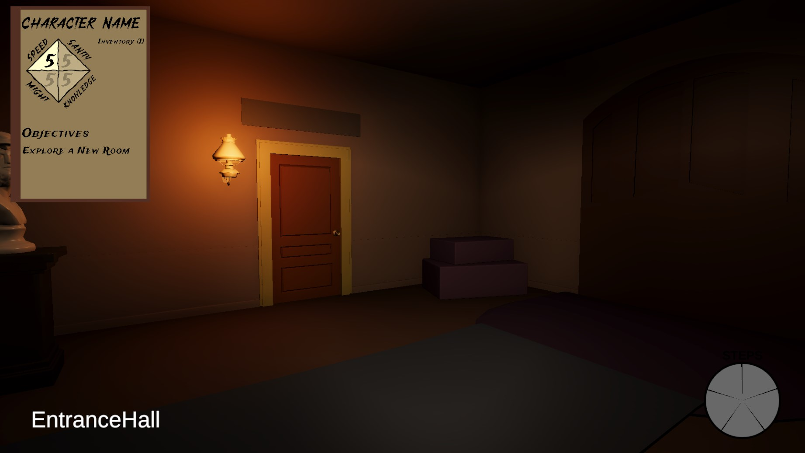
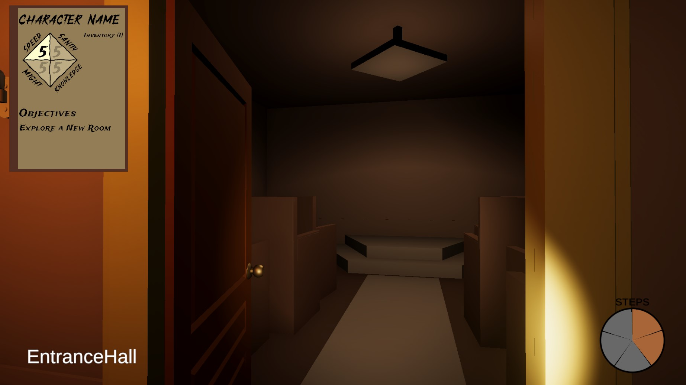
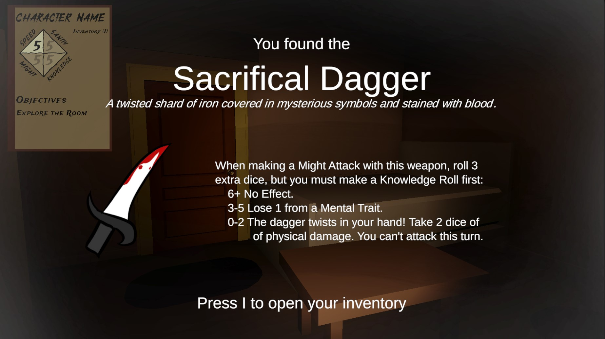

 

# House on the Hill Capstone Project

#### Brandon Coffey and Jackie Garza

 

House on the Hill is a digital first person adaptation of the board game: Betrayal at House on the Hill by Avalon Hill. The game can be downloaded from Itch.io in the link below, along with a dedicated server to host the multiplayer aspects of the game (It is also playable single-player but intended for multiplayer).

<iframe frameborder="0" src="https://itch.io/embed/2061249?dark=true" width="552" height="167">
    <a href="https://brandoncoffey.itch.io/house-on-the-hill">House on the Hill by BrandonCoffey</a>
</iframe>

 
 
 

This Capstone Page is still a Work in Progress. Check back at a later date for a completed demo / showcase.

 
 
 

{: class="half-l" }
{: class="half-r" }

 

House on the Hill is a first person exploration game set in a haunted house.

{: class="full" }

 

There are also various Items and Omens to find and collect throughout the house, which have certain effects on the character.

{: class="full" }

